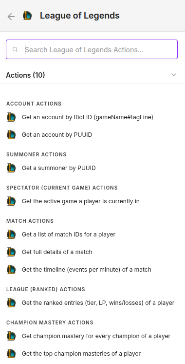
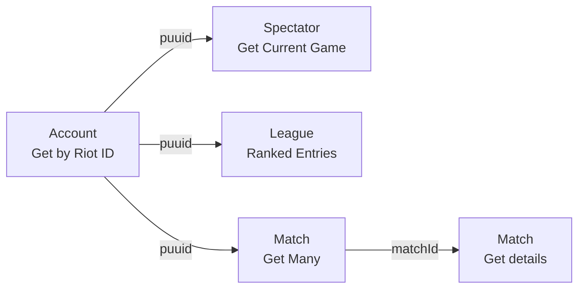

# n8n-nodes-leagueoflegends

[](https://www.npmjs.com/package/n8n-nodes-leagueoflegends)
[](https://www.npmjs.com/package/n8n-nodes-leagueoflegends)
[](./LICENSE)

Community node for n8n to interact with the **Riot Games / League of Legends API** —
current game, match history, ranked stats, champion mastery and more.

## Installation

In your n8n instance, go to **Settings → Community Nodes → Install** and enter:

```
n8n-nodes-leagueoflegends
```

Then create a **Riot Games API** credential with your `RGAPI-...` key (see below).
Manual / Docker deployment is also documented further down.

## Preview

A single **League of Legends** node exposing 10 actions grouped by resource:

<p align="center">
  
</p>

## What it does

The node exposes the following resources & operations:

| Resource | Operation | Riot endpoint |
|---|---|---|
| **Account** | Get by Riot ID | `account-v1 /accounts/by-riot-id/{name}/{tag}` |
| **Account** | Get by PUUID | `account-v1 /accounts/by-puuid/{puuid}` |
| **Summoner** | Get by PUUID | `summoner-v4 /summoners/by-puuid/{puuid}` |
| **Spectator** | Get Current Game | `spectator-v5 /active-games/by-summoner/{puuid}` |
| **Match** | Get Many (history) | `match-v5 /matches/by-puuid/{puuid}/ids` |
| **Match** | Get | `match-v5 /matches/{matchId}` |
| **Match** | Get Timeline | `match-v5 /matches/{matchId}/timeline` |
| **League** | Get Ranked Entries | `league-v4 /entries/by-puuid/{puuid}` |
| **Champion Mastery** | Get All / Get Top | `champion-mastery-v4 /champion-masteries/by-puuid/{puuid}` |

Regional routing (platform host like `euw1` vs continent host like `europe`) is derived
automatically from the **Platform** you pick on the node.

## Prerequisites

- A Riot API key from https://developer.riotgames.com/ (dev keys expire every 24h).

## Credentials

In n8n, create a **Riot Games API** credential and paste your `RGAPI-...` key.
The key is sent as the `X-Riot-Token` header on every request. The credential test
hits `lol/status/v4/platform-data` on EUW.

## Typical flow: "what is player X doing right now?"

1. **Account → Get by Riot ID** (`gameName` = `Faker`, `tagLine` = `KR1`) → returns `puuid`
2. **Spectator → Get Current Game** (`puuid`) → live game if in one (404 = not in game)
3. **League → Get Ranked Entries** (`puuid`) → tier / LP / wins / losses
4. **Match → Get Many** (`puuid`, filter queue `420`) → recent match IDs
5. **Match → Get** (loop over each `matchId`) → full stats per game



## Build

```bash
npm install --ignore-scripts   # --ignore-scripts avoids compiling isolated-vm (not needed to build)
npm run build                  # tsc + copy icons into dist/
```

## Deploy to a self-hosted (Docker) n8n

n8n auto-loads packages placed in `~/.n8n/custom/node_modules/`. On this NAS the n8n
data dir is bind-mounted `host:/compose/n8n_data -> container:/home/node/.n8n`, so:

```bash
# from the project dir, after `npm run build`
mkdir -p /compose/n8n_data/custom/node_modules
cp -r . /compose/n8n_data/custom/node_modules/n8n-nodes-leagueoflegends
# then restart n8n so it re-scans custom nodes
docker restart n8n
```

Only `package.json` + `dist/` are actually needed at runtime (`n8n-workflow` is a peer
dependency provided by n8n itself). After restart, search for "League of Legends" in the
node picker.

## Notes

- `queue` and `type` filters on Match → Get Many are mutually exclusive (Riot limitation).
- Rate limits: dev keys are ~20 req/s, 100 req/2min. Add a Wait/Loop if you fan out.
- `spectator-v5` returns HTTP 404 when the player is not currently in a game. The node
  treats this as an expected "no data" case for **Get Current Game**: it emits no items
  instead of failing, so a polling workflow simply does nothing when the player is idle.

## Disclaimer

n8n-nodes-leagueoflegends isn't endorsed by Riot Games and doesn't reflect the views or
opinions of Riot Games or anyone officially involved in producing or managing Riot Games
properties. Riot Games, and all associated properties are trademarks or registered
trademarks of Riot Games, Inc.
